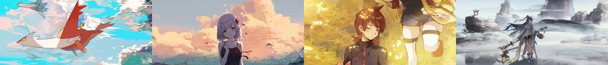
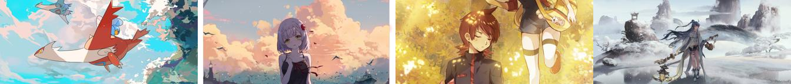

# Masked-Parallel-Seam-Carving

Adding instance segmentation to the seam carving algorithm

## How to use

_Note:_ I highly recommend using a virtual environment for this. The setup that I had was: python3.7, pytorch1.8 (running on CUDA)

1. Step 1: Install Pytorch (ideally from the pytorch website: https://pytorch.org/). Here's the version I ran.

```
python3 -m pip install torch==1.8.2 torchvision==0.9.2 torchaudio==0.8.2 --extra-index-url https://download.pytorch.org/whl/lts/1.8/cu111
```

2. Install Detectron2

```
python3 -m pip install 'git+https://github.com/facebookresearch/detectron2.git'
```

3. Set up AdelaiDet

```
git clone git clone https://github.com/aim-uofa/AdelaiDet.git
cd AdelaiDet
python3.7 setup.py build develop
```

4. Get the [instance segmentation model from the YAAS repository](https://drive.google.com/file/d/1-wFdQ4jwSTeJ7wGD3YKNJdcpSS5Ho8c9/view?usp=sharing)

5. Run the model:

```bash
# if you're in the AdelaiDet Repo
cd ..

# run model
python3.7 makeultrawide.py <src_folder> <dest_folder>
```

## Results

On Running the following 4 16:9 images


through the algorithm, we get the following 21:9 output



As an interesting comparison, here's the original 21:9 images that the input images were cropped from:



## Credits

1. [Yet-Another-Anime-Segmenter (trained model)](https://github.com/zymk9/Yet-Another-Anime-Segmenter)
2. [AdelaiDet](https://github.com/aim-uofa/AdelaiDet)
3. [Detectron2 (SOLOv2 Instance Segmentation)](https://github.com/facebookresearch/detectron2)
4. [Seam Carving](https://github.com/li-plus/seam-carving)
5. All Images were taken from the [Danbooru2021 dataset](https://www.gwern.net/Danbooru2021)
